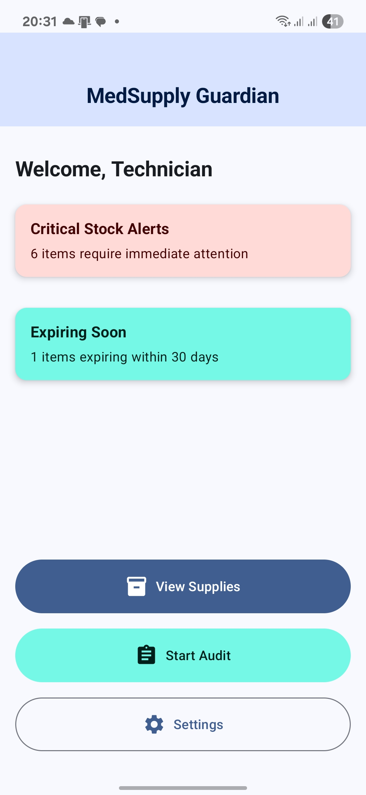
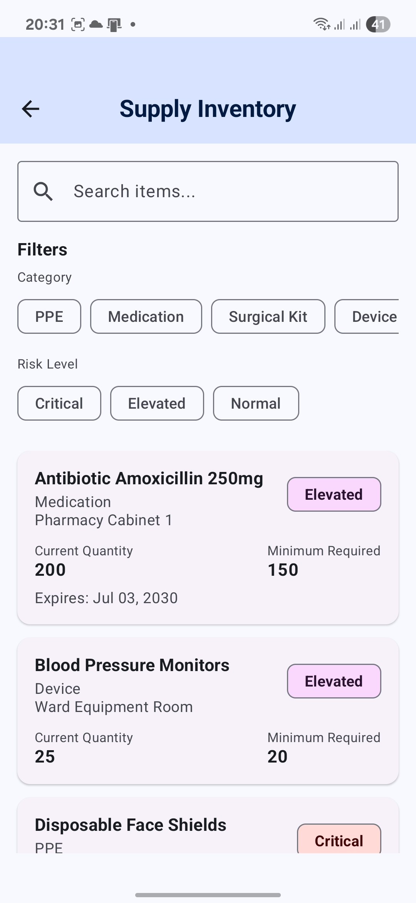
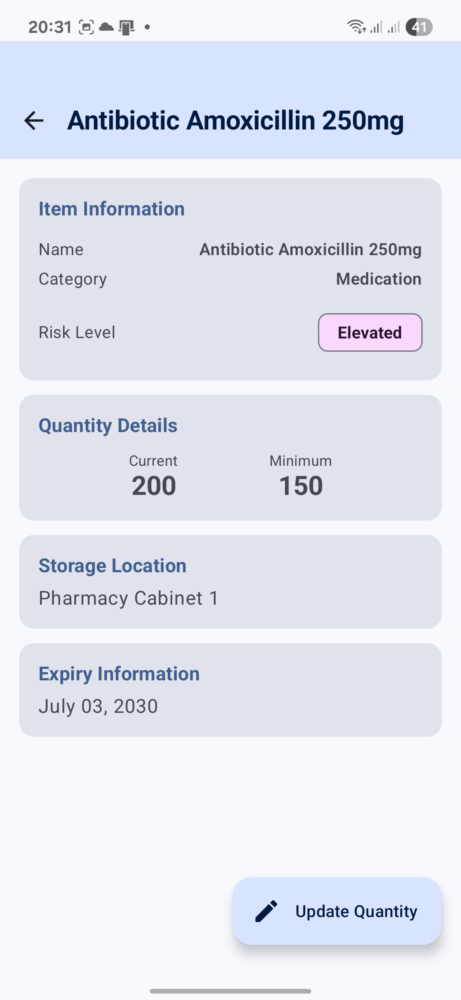
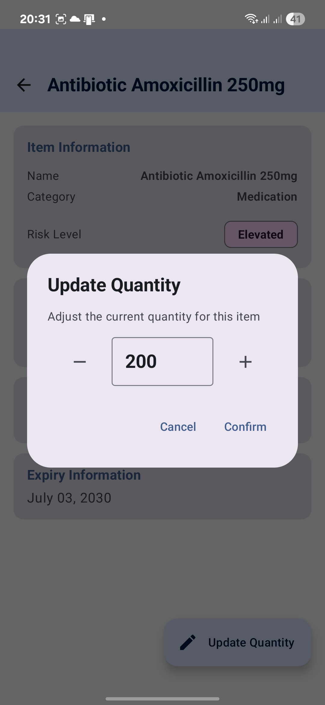
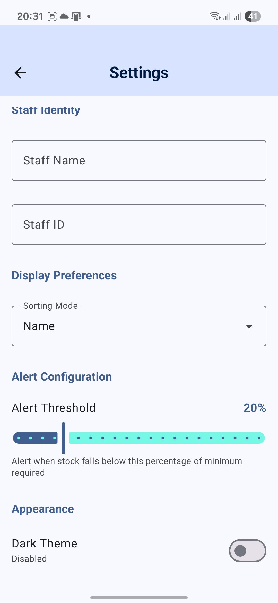
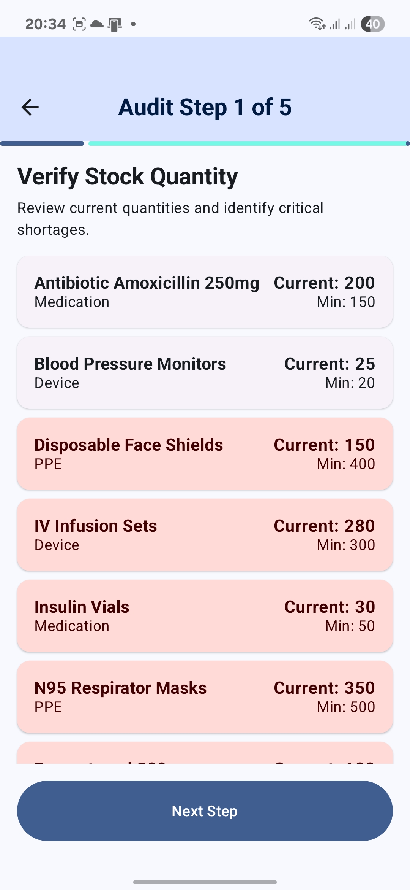

# MedSupply Guardian

**Version:** 2.0  
**Author:** Gustavo Sanchez  
**Build System:** Gradle with Kotlin DSL  
**Minimum SDK:** 24 (Android 7.0)  
**Target SDK:** 35

## Project Overview

MedSupply Guardian is an enterprise-grade mobile healthcare supply management and compliance audit application built with Jetpack Compose and Material Design 3. The application enables hospital staff to conduct offline compliance audits, track medical supply inventory, and manage critical stock levels in real-time.

The application addresses key challenges in healthcare supply chain management:
- Regulatory compliance tracking
- Critical stock monitoring
- Expiry date management
- Multi-step audit workflows
- Offline data persistence

## Technology Stack

| Technology | Purpose |
|------------|---------|
| Jetpack Compose | Entire UI layer implementation |
| Material Design 3 | Theming and component library |
| Room Database | Local SQLite data persistence |
| SharedPreferences | User settings and preferences storage |
| Navigation Compose | Type-safe screen navigation |
| Kotlin Coroutines | Asynchronous operations and background tasks |
| StateFlow | Reactive state management |
| ViewModel | UI state holder with lifecycle awareness |

## Architecture

### Clean Architecture Implementation

The application follows Clean Architecture principles with clear separation of concerns across three primary layers:

#### 1. Data Layer

**Location:** `com.gustavosanchez.medsupplyguardian.data`

The data layer handles all data operations and persistence mechanisms:

**Room Database:**
```kotlin
@Database(entities = [SupplyItem::class], version = 1)
@TypeConverters(DateConverter::class)
abstract class AppDatabase : RoomDatabase()
```

- **Entity:** `SupplyItem` - Represents medical supply items with fields for name, category, quantities, expiry dates, location, and computed risk levels
- **DAO:** `SupplyItemDao` - Provides 15 database operations using suspend functions and Flow for reactive queries
- **Type Converters:** `DateConverter` - Handles Date to Long conversions for Room compatibility
- **Database Initialization:** Singleton pattern with callback-based sample data population

**Repository Pattern:**
```kotlin
class SupplyRepository(private val supplyItemDao: SupplyItemDao)
```

The repository abstracts data sources from the presentation layer, providing a clean API for ViewModels. All database operations are exposed as Flow for reactive updates.

**SharedPreferences Management:**
```kotlin
class PreferencesManager(context: Context)
```

Manages user preferences with StateFlow-based reactive updates:
- Staff identity (name and ID)
- Sorting preferences
- Alert thresholds
- Theme mode
- Audit reminder intervals

#### 2. Domain Layer

**Location:** `com.gustavosanchez.medsupplyguardian.domain`

Contains business logic and data models independent of framework implementations:

**Models:**
- `UserPreferences` - Immutable data class encapsulating all user settings
- Risk calculation logic in `SupplyItem.Companion.computeRiskLevel()`

Risk assessment rules:
- **Critical:** Current quantity < minimum required OR expiring within 7 days
- **Elevated:** Current quantity ≤ 150% of minimum OR expiring within 30 days
- **Normal:** Adequate stock with no immediate concerns

#### 3. Presentation Layer

**Location:** `com.gustavosanchez.medsupplyguardian.presentation`

Implements the UI using Jetpack Compose with Material Design 3 components.

**ViewModel Architecture:**

```kotlin
class MainViewModel(
    private val repository: SupplyRepository,
    private val preferencesManager: PreferencesManager
) : ViewModel()
```

**State Management:**
- All UI state exposed as StateFlow for reactive composition
- Combines multiple data streams using Flow operators
- Survives configuration changes
- Automatic cancellation on ViewModel cleanup

**Navigation:**
```kotlin
sealed class NavRoutes(val route: String)
```

Type-safe navigation with parameter support:
- Static routes for simple screens
- Dynamic routes with ID parameters for detail screens
- Route creation helpers for programmatic navigation

**Screen Components:**

Each screen follows a consistent structure:
1. Scaffold with Material 3 top bar
2. ViewModel injection via factory pattern
3. State collection using `collectAsState()`
4. Reactive UI updates on state changes
5. Event handling through ViewModel methods

### Dependency Injection

Manual dependency injection implemented through the Application class:

```kotlin
class MedSupplyGuardianApplication : Application() {
    val database: AppDatabase by lazy { AppDatabase.getDatabase(this) }
    val repository: SupplyRepository by lazy { SupplyRepository(database.supplyItemDao()) }
    val preferencesManager: PreferencesManager by lazy { PreferencesManager(this) }
}
```

ViewModels receive dependencies through custom factory implementations:

```kotlin
class MainViewModelFactory(
    private val repository: SupplyRepository,
    private val preferencesManager: PreferencesManager
) : ViewModelProvider.Factory
```

## Module Implementation

### Module 1: Room Database

**Package:** `com.gustavosanchez.medsupplyguardian.data.local`

**Entity Schema:**
```kotlin
@Entity(tableName = "supply_items")
data class SupplyItem(
    @PrimaryKey(autoGenerate = true) val itemId: Int = 0,
    val name: String,
    val category: String,
    val minimumRequired: Int,
    val currentQuantity: Int,
    val expiryDate: Long?,
    val location: String,
    val riskLevel: String
)
```

**DAO Operations:**
- `getAllItems(): Flow<List<SupplyItem>>` - Retrieves all items with real-time updates
- `searchItems(keyword: String): Flow<List<SupplyItem>>` - Case-insensitive search
- `filterByCategory(category: String): Flow<List<SupplyItem>>` - Category filtering
- `filterByLocation(location: String): Flow<List<SupplyItem>>` - Location filtering
- `filterByRisk(riskLevel: String): Flow<List<SupplyItem>>` - Risk-based filtering
- `getItemById(id: Int): Flow<SupplyItem?>` - Single item retrieval
- `updateQuantity(id: Int, newQuantity: Int): suspend` - Quantity updates
- `insertItem(item: SupplyItem): suspend` - New item insertion
- `updateItem(item: SupplyItem): suspend` - Complete item update
- `deleteItem(item: SupplyItem): suspend` - Item deletion
- `getCriticalItems(): Flow<List<SupplyItem>>` - Critical items only
- `getExpiringItems(thresholdTimestamp: Long): Flow<List<SupplyItem>>` - Expiring items

**Database Initialization:**

The database pre-populates 10 realistic healthcare supply items on first creation:
- PPE items (masks, gloves, face shields)
- Medications (antibiotics, insulin, paracetamol)
- Surgical supplies (scalpels, sutures)
- Medical devices (blood pressure monitors, IV sets)

### Module 2: SharedPreferences

**Package:** `com.gustavosanchez.medsupplyguardian.data.preferences`

**Stored Preferences:**

| Preference | Type | Default | Purpose |
|------------|------|---------|---------|
| staffName | String | "" | Technician full name |
| staffId | String | "" | Unique staff identifier |
| sortingMode | String | "Name" | Supply list sorting order |
| alertThreshold | Int | 20 | Low stock alert percentage |
| isDarkTheme | Boolean | false | Theme mode selection |
| auditReminderHours | Int | 24 | Audit notification interval |

**Reactive Updates:**

All preference changes emit through StateFlow:
```kotlin
val userPreferences: StateFlow<UserPreferences>
```

Theme changes apply immediately throughout the application without restart.

### Module 3: Progress Indicators

**Three Required Implementations:**

1. **Startup Loading (CircularProgressIndicator)**
   - Displayed in MainActivity during database initialization
   - Centered on screen with 1.5-second simulated load time
   - Uses Material 3 primary color scheme

2. **Audit Step Completion (LinearProgressIndicator)**
   - Full-width indicator at top of audit screens
   - Progress calculation: `currentStep / 5f`
   - Updates as user progresses through 5-step workflow
   - Material 3 track and indicator colors

3. **Upload Simulation (CircularProgressIndicator with Overlay)**
   - Semi-transparent background overlay during upload
   - Centered progress indicator with descriptive text
   - 2.5-second simulated upload duration
   - Automatic navigation on completion

## Screen Specifications

### Home Screen

**File:** `HomeScreen.kt`

**Components:**
- CenterAlignedTopAppBar with app title
- Personalized greeting with staff name from preferences
- Critical Stock Alerts card (errorContainer background)
- Expiring Soon card (secondaryContainer background)
- Three action buttons with distinct styles:
  - FilledButton for View Supplies
  - FilledTonalButton for Start Audit
  - OutlinedButton for Settings

**Data Sources:**
- `criticalItems` - Real-time flow of critical items
- `expiringItems` - Items expiring within 30 days
- `userPreferences` - Staff name for greeting

### Supplies List Screen

**File:** `SuppliesListScreen.kt`

**Components:**
- OutlinedTextField search bar with clear button
- FilterChip groups for Category and Risk Level
- LazyColumn with ElevatedCard items
- Color-coded AssistChip risk badges
- Empty state handling

**Features:**
- Real-time search filtering by name
- Multi-criteria filtering (Category + Risk)
- Clear All functionality
- Tap-to-navigate to detail screen
- Date formatting for expiry display

**Material 3 Compliance:**
- ElevatedCard with 4dp elevation
- FilterChip selected/unselected states
- AssistChip with contextual colors
- Typography hierarchy (titleMedium, bodyLarge, bodyMedium)

### Supply Detail Screen

**File:** `SupplyDetailScreen.kt`

**Components:**
- Four information cards (Item, Quantity, Location, Expiry)
- ExtendedFloatingActionButton for quantity updates
- AlertDialog with increment/decrement controls
- OutlinedTextField for manual quantity entry
- Input validation with error states

**Validation Rules:**
- Quantity must be numeric
- Quantity cannot be negative
- Empty input triggers error state
- Real-time validation on input change

**Update Flow:**
1. User taps "Update Quantity" FAB
2. Dialog displays with current quantity
3. User adjusts via buttons or manual input
4. Validation checks on confirm
5. Database update via ViewModel
6. Automatic UI refresh via StateFlow

### Settings Screen

**File:** `SettingsScreen.kt`

**Components:**
- LazyColumn with 24dp vertical spacing
- Section headers with primary color
- Six preference inputs:
  1. Staff Name (OutlinedTextField)
  2. Staff ID (OutlinedTextField)
  3. Sorting Mode (ExposedDropdownMenuBox)
  4. Alert Threshold (Slider with percentage display)
  5. Dark Theme (Switch with state label)
  6. Audit Reminder (OutlinedTextField with numeric keyboard)
- FilledTonalButton save action

**Persistence Behavior:**
- All settings save on button click
- Immediate theme reflection
- Settings survive app restart
- Navigation back after save

### Audit Workflow Screens

**Files:** `AuditScreens.kt`, `AuditViewModel.kt`

**Audit Start Screen:**
- Workflow overview with step descriptions
- Total item count display
- Begin Audit button to initialize workflow

**Audit Step Screen (Steps 1-5):**

**Step 1: Verify Stock Quantity**
- Displays all items with current vs minimum quantities
- Critical items highlighted with errorContainer background
- ElevatedCard layout for each item

**Step 2: Check Expiry Dates**
- Shows items expiring within 30 days
- Color coding based on urgency:
  - Red (errorContainer) for ≤7 days
  - Orange (tertiaryContainer) for ≤30 days
- Displays days remaining calculation

**Step 3: Validate Storage Conditions**
- Checkbox list with 5 storage requirements:
  - Temperature within safe range
  - Humidity acceptable
  - Storage area clean
  - Items properly sealed
  - No obstructions to access
- State tracking in AuditViewModel

**Step 4: Identify Missing/Damaged Items**
- FilterChip selection (None, Missing, Damaged, Both)
- Optional comments field (OutlinedTextField)
- Multi-line text input support

**Step 5: Review Summary**
- Statistics card with audit overview:
  - Total items reviewed
  - Items failing compliance
  - Items expiring soon
- Complete Audit button with check icon

**Audit Summary Screen:**
- Complete audit report display
- Technician information (from preferences)
- Date and time stamp
- Upload button triggering simulation
- Progress overlay during upload
- Navigation to home on completion

**Progress Indicator Integration:**
- LinearProgressIndicator on all step screens
- Progress calculation: `stepNumber / 5f`
- Full-width placement below top bar
- Material 3 color scheme

## Screenshots

|  |  |  |
|---|---|---|
|  |  |  |

### Component Usage

| Component | Usage Count | Purpose |
|-----------|-------------|---------|
| CenterAlignedTopAppBar | 7 | All screen navigation bars |
| ElevatedCard | 25+ | List items and information cards |
| Card | 15+ | Section containers |
| FilterChip | 8 | Category and risk filtering |
| AssistChip | 10+ | Risk level badges |
| FilledButton | 5 | Primary actions |
| FilledTonalButton | 4 | Secondary actions |
| OutlinedButton | 2 | Tertiary actions |
| ExtendedFloatingActionButton | 1 | Quantity updates |
| OutlinedTextField | 8 | Text inputs |
| ExposedDropdownMenuBox | 1 | Sorting selection |
| Slider | 1 | Threshold adjustment |
| Switch | 1 | Theme toggle |
| Checkbox | 5 | Storage validation |
| AlertDialog | 1 | Quantity update interface |
| LinearProgressIndicator | 5 | Audit progression |
| CircularProgressIndicator | 2 | Loading states |

### Color Scheme

**Primary Color:** Medical Blue (#0066CC)
- Conveys trust and professionalism
- Used for primary actions and emphasis

**Secondary Color:** Healthcare Teal (#00897B)
- Complements primary while maintaining clarity
- Used for secondary containers and informational elements

**Error Color:** Critical Red
- errorContainer for critical alerts and shortages
- Immediate visual attention for urgent items

**Tertiary Color:** Warning Amber
- tertiaryContainer for elevated risk items
- Mid-level urgency indication

### Typography Scale

| Style | Font Size | Line Height | Usage |
|-------|-----------|-------------|-------|
| titleLarge | 22sp | 28sp | Screen titles, major headings |
| titleMedium | 16sp | 24sp | Section headers, card titles |
| bodyLarge | 16sp | 24sp | Primary text content |
| bodyMedium | 14sp | 20sp | Secondary text, descriptions |
| labelLarge | 14sp | 20sp | Button labels |

## Data Flow Architecture

### Read Operations Flow

```
User Action → Composable → ViewModel.stateFlow.collectAsState() 
→ Repository.flowFunction() → DAO.queryFlow() → Room Database 
→ Flow Emission → StateFlow Update → Recomposition
```

### Write Operations Flow

```
User Action → Composable Event → ViewModel.suspendFunction() 
→ viewModelScope.launch → Repository.suspendFunction() 
→ DAO.suspendQuery() → Room Database → Flow Emission 
→ Automatic UI Update
```

### Preference Updates Flow

```
User Input → ViewModel.updatePreference() → PreferencesManager.savePreferences() 
→ SharedPreferences.edit().apply() → StateFlow.emit() 
→ Composable Recomposition → Theme/UI Update
```

## Build Configuration

### Dependencies

```kotlin
// Core Android
implementation(libs.androidx.core.ktx)
implementation(libs.androidx.lifecycle.runtime.ktx)
implementation(libs.androidx.activity.compose)

// Compose BOM
implementation(platform(libs.androidx.compose.bom))
implementation(libs.androidx.ui)
implementation(libs.androidx.material3)

// Room Database
implementation("androidx.room:room-runtime:2.6.1")
implementation("androidx.room:room-ktx:2.6.1")
ksp("androidx.room:room-compiler:2.6.1")

// Navigation
implementation("androidx.navigation:navigation-compose:2.8.4")

// ViewModel
implementation("androidx.lifecycle:lifecycle-viewmodel-compose:2.8.7")

// Coroutines
implementation("org.jetbrains.kotlinx:kotlinx-coroutines-android:1.9.0")
```

### Gradle Configuration

```kotlin
android {
    namespace = "com.gustavosanchez.medsupplyguardian"
    compileSdk = 35
    
    defaultConfig {
        applicationId = "com.gustavosanchez.medsupplyguardian"
        minSdk = 24
        targetSdk = 35
        versionCode = 1
        versionName = "1.0"
    }
    
    compileOptions {
        sourceCompatibility = JavaVersion.VERSION_11
        targetCompatibility = JavaVersion.VERSION_11
    }
    
    kotlinOptions {
        jvmTarget = "11"
    }
    
    buildFeatures {
        compose = true
    }
}
```

## Testing Strategy

### Unit Testing Targets
- ViewModel state management logic
- Repository data transformation
- Risk calculation algorithms
- Preference persistence logic

### Integration Testing Targets
- Room database operations
- Navigation flows
- SharedPreferences synchronization

### UI Testing Targets
- Screen composition
- User interaction flows
- Form validation
- Navigation transitions

## Performance Optimizations

### Database Performance
- Flow-based queries for reactive updates
- Indexed columns on frequently queried fields
- Singleton database instance
- Coroutine-based async operations

### UI Performance
- LazyColumn for efficient list rendering
- State hoisting to minimize recomposition
- Derived state with `remember` for computed values
- Immutable data classes for stability

### Memory Management
- ViewModel lifecycle awareness
- Automatic coroutine cancellation
- Efficient Flow collection with `stateIn()`
- Lazy initialization of heavy resources

## Accessibility Features

- Minimum 48dp touch targets on all interactive elements
- ContentDescription on all icons and images
- High contrast color ratios meeting WCAG guidelines
- Clear typography hierarchy for screen readers
- Semantic UI structure with proper focus order

## Future Enhancements

### Planned Features
1. Barcode scanning for quick item lookup
2. Photo attachment for damage documentation
3. Multi-language support for international deployment
4. Offline sync with remote server
5. Advanced analytics dashboard
6. Role-based access control
7. Push notifications for critical alerts
8. Export audit reports to PDF
9. Integration with hospital ERP systems
10. Automated reorder suggestions

### Technical Improvements
1. Migration to Hilt for dependency injection
2. Comprehensive test coverage (unit, integration, UI)
3. Continuous integration pipeline
4. Crashlytics integration
5. Performance monitoring
6. A/B testing framework
7. Multi-module architecture
8. Dark mode optimization
9. Tablet layout support
10. Wear OS companion app

## License

Copyright 2025 Gustavo Sanchez. All rights reserved.

This project is developed as part of academic coursework for healthcare supply management system design and implementation.

## Contact

**Developer:** Gustavo Sanchez  
**Project Repository:** https://github.com/SiDeRaL12/MedSupplyGuardian  
**Documentation:** Complete project documentation available in repository wiki

***

**Last Updated:** November 18, 2025  
**Build Status:** Production Ready  